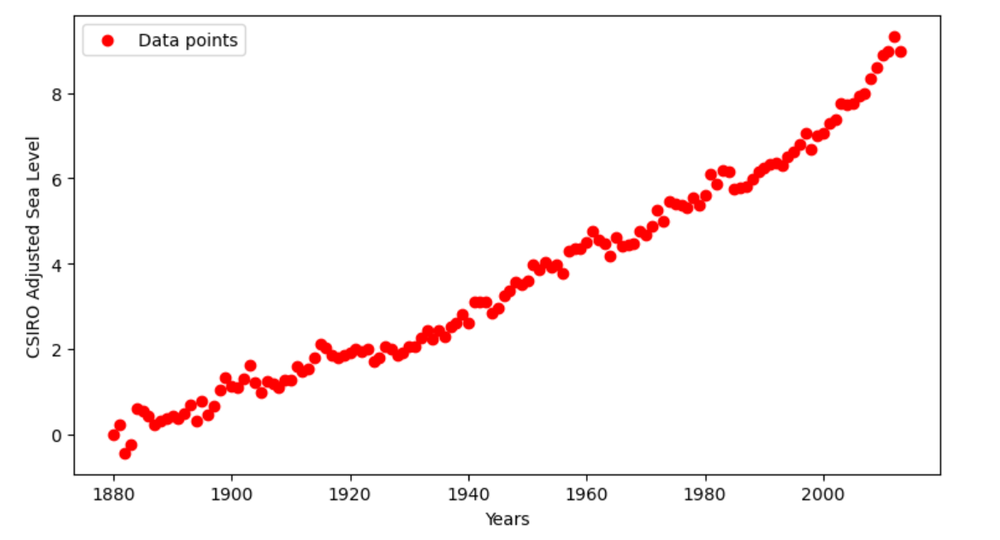

# **Sea Level Predictor**

## Description :
In this project, a dataset of the global average sea level change from year 1880 to 2013 is analysed. The dataset is used for predicting the sea level in year 2050.

## Dataset Overview :
Columns:-

Year: From 1880-2013 the sea level measurements are recorded.

CSIRO Adjusted Sea Level: The sea level measurement reported by CSIRO for the respective year.

Lower Error Bound: The lower bound of the error range associated with the sea level measurement.

Upper Error Bound: The upper bound of the error range associated with the sea level measurement.

## Project Approach :

◊ Importing the data from csv file using pandas and then creating a scatter plot for 'Year' and 'CSIRO Adjusted sea level' using matplotlib. 

◊ Plotting a linear regression line of best fit over the scatter plot using lineregress function from scipy.stats and then extending it till the year 2050 to predict the sea level.

◊ As there comes a shift in data points from year 2000. Plotting another linear regression line of best fit by using the data from year 2000 only to predict the sea level in year 2050.

## Outcomes :

→ Scatter plot

→ Linear regression lines to predict sea level in 2050

## Data Source :
Global Average Absolute Sea Level Change, 1880-2013 from the US Environmental Protection Agency using data from CSIRO, 2015.

